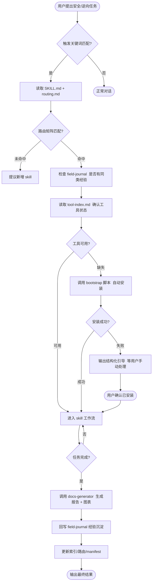
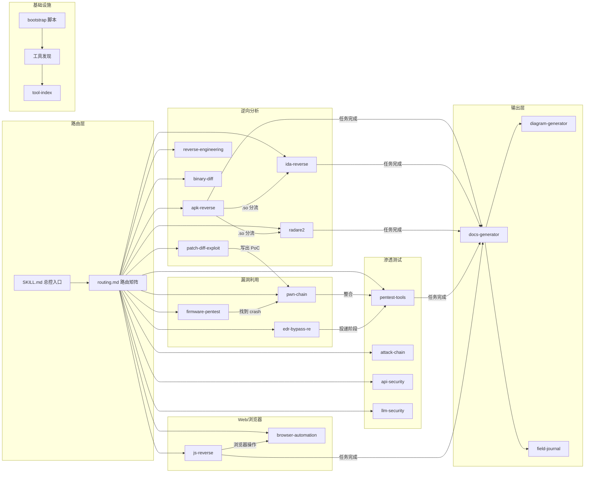
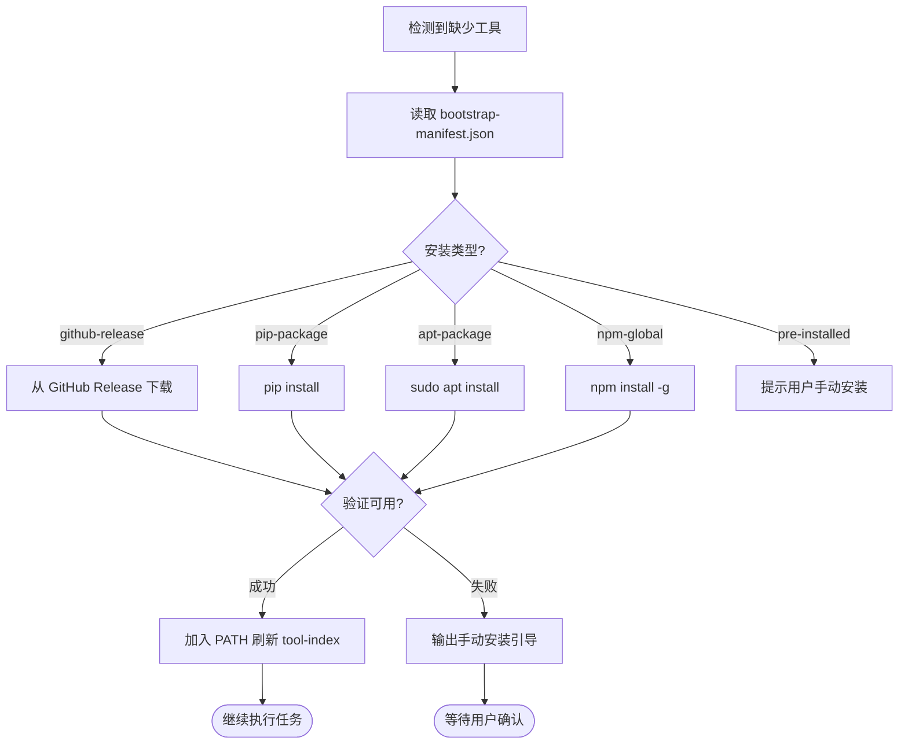
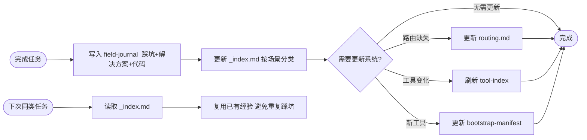
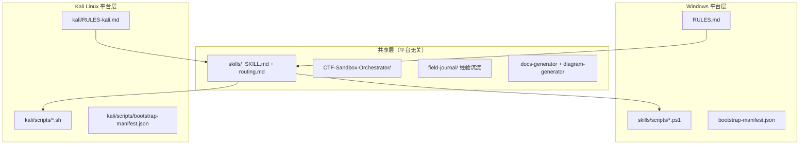

# 系统架构图

## 完整行为链流程图

```mermaid
flowchart TD
    Start([用户提出安全/逆向任务]) --> Detect{触发关键词匹配?}
    Detect -->|是| ReadRouting[读取 SKILL.md + routing.md]
    Detect -->|否| Normal([正常对话])
    ReadRouting --> RouteMatch{路由矩阵匹配?}
    RouteMatch -->|未命中| ProposeNew[提议新增 skill]
    RouteMatch -->|命中| CheckJournal[检查 field-journal  是否有同类经验]
    CheckJournal --> CheckTools[读取 tool-index.md  确认工具状态]
    CheckTools --> ToolOK{工具可用?}
    ToolOK -->|缺失| Bootstrap[调用 bootstrap 脚本  自动安装]
    ToolOK -->|可用| Execute[进入 skill 工作流]
    Bootstrap --> BootOK{安装成功?}
    BootOK -->|成功| Execute
    BootOK -->|失败| Guide[输出结构化引导  等用户手动处理]
    Guide --> UserConfirm([用户确认已安装])
    UserConfirm --> Execute
    Execute --> TaskDone{任务完成?}
    TaskDone -->|否| Execute
    TaskDone -->|是| GenReport[调用 docs-generator  生成报告 + 图表]
    GenReport --> WriteJournal[回写 field-journal  经验沉淀]
    WriteJournal --> UpdateIndex[更新索引/路由/manifest]
    UpdateIndex --> Output([输出最终结果])
```

## Skills 模块关系图

```mermaid
flowchart LR
    subgraph 路由层
        SKILL[SKILL.md  总控入口]
        Routing[routing.md  路由矩阵]
    end

    subgraph 逆向分析
        APK[apk-reverse]
        IDA[ida-reverse]
        R2[radare2]
        RE[reverse-engineering]
        BinDiff[binary-diff]
        PatchDiff[patch-diff-exploit]
    end

    subgraph 漏洞利用
        Pwn[pwn-chain]
        Firmware[firmware-pentest]
        EDR[edr-bypass-re]
    end

    subgraph 渗透测试
        Pentest[pentest-tools]
        Attack[attack-chain]
        API[api-security]
        LLM[llm-security]
    end

    subgraph Web/浏览器
        JS[js-reverse]
        Browser[browser-automation]
    end

    subgraph 基础设施
        Bootstrap[bootstrap 脚本]
        Discovery[工具发现]
        ToolIndex[tool-index]
    end

    subgraph 输出层
        Docs[docs-generator]
        Diagram[diagram-generator]
        Journal[field-journal]
    end

    SKILL --> Routing
    Routing --> APK & IDA & R2 & RE & BinDiff & PatchDiff
    Routing --> Pentest & JS & Browser & Pwn & Firmware & EDR
    Routing --> Attack & API & LLM

    APK -->|.so 分流| IDA
    APK -->|.so 分流| R2
    PatchDiff -->|写出 PoC| Pwn
    Firmware -->|找到 crash| Pwn
    Pwn -->|整合| Pentest
    EDR -->|投递阶段| Pentest
    JS -->|浏览器操作| Browser

    Bootstrap --> Discovery --> ToolIndex

    APK & IDA & R2 & Pentest & JS -->|任务完成| Docs
    Docs --> Diagram
    Docs --> Journal
```

## Bootstrap 自举流程

```mermaid
flowchart TD
    Need[检测到缺少工具] --> ReadManifest[读取 bootstrap-manifest.json]
    ReadManifest --> Kind{安装类型?}
    Kind -->|github-release| GH[从 GitHub Release  下载]
    Kind -->|pip-package| Pip[pip install]
    Kind -->|apt-package| Apt[sudo apt install]
    Kind -->|npm-global| NPM[npm install -g]
    Kind -->|pre-installed| Manual[提示用户手动安装]
    GH & Pip & Apt & NPM --> Verify{验证可用?}
    Verify -->|成功| AddPath[加入 PATH  刷新 tool-index]
    Verify -->|失败| ManualOut[输出手动安装引导]
    AddPath --> Continue([继续执行任务])
    ManualOut --> Wait([等待用户确认])
```

## 自动进化机制

```mermaid
flowchart LR
    Task([完成任务]) --> WriteLog[写入 field-journal  踩坑+解决方案+代码]
    WriteLog --> UpdateIdx[更新 _index.md  按场景分类]
    UpdateIdx --> CheckUpdate{需要更新系统?}
    CheckUpdate -->|路由缺失| FixRoute[更新 routing.md]
    CheckUpdate -->|工具变化| FixTool[刷新 tool-index]
    CheckUpdate -->|新工具| FixManifest[更新 bootstrap-manifest]
    CheckUpdate -->|无需更新| Done([完成])
    FixRoute & FixTool & FixManifest --> Done

    NewTask([下次同类任务]) --> ReadIdx[读取 _index.md]
    ReadIdx --> Reuse[复用已有经验  避免重复踩坑]
```

## 多平台支持架构

```mermaid
flowchart TD
    subgraph 共享层["共享层（平台无关）"]
        Skills[skills/  SKILL.md + routing.md]
        CTF[CTF-Sandbox-Orchestrator/]
        Journal[field-journal/  经验沉淀]
        Docs[docs-generator + diagram-generator]
    end

    subgraph Windows["Windows 平台层"]
        WinScripts[skills/scripts/*.ps1]
        WinManifest[bootstrap-manifest.json]
        WinRules[RULES.md]
    end

    subgraph Kali["Kali Linux 平台层"]
        KaliScripts[kali/scripts/*.sh]
        KaliManifest[kali/scripts/bootstrap-manifest.json]
        KaliRules[kali/RULES-kali.md]
    end

    Skills --> WinScripts & KaliScripts
    WinRules --> Skills
    KaliRules --> Skills
```
